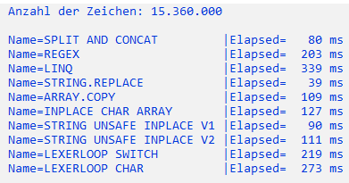

# Das Best Practice Dilemma

beschreibt die Situation, eine Aufgabe erledigen zu müssen, für die ich nicht über ausreichendes Know-How verfüge. Hier gehe ich auf die Suche nach einer geeigneten **Best Practice**-Lösung
 um die Aufgabe wenigsten Ansatzweise lösen zu können.
Was ist aber das Problem mit **Best Practice**? **Best Practice** unterliegen einem 
gewissen Zeitgeit. Eine Lösungen für eine Aufgabe von vor 10 Jahren, ist eine andere Lösung wie für die gleiche Aufgabe heute.
Ein weiteres Problem ist auch heraus zufinden, wie gut ist eigentlich meine gefunden Lösung.
Frei nach dem Spruch "1000 Fliegen können sich nicht irren", kann ein gefundener **Best Practice** zwar funktionieren, ist aber eben nicht die beste Lösung.
Es gibt durchaus Aspekte bei dem es tatsächlich nicht so wichtig ist, wie gute die gefundene Lösung ist, Hauptsache die gefundene Lösung funktioniert.
Bei der Programmierung kann das ein durchaus wichtiger Aspekt sein.

Hierzu ein Beispiel: 
Aufgabe ist es, eine Lösung zu finden, bei der alle Leerzeichen aus einen Text entfernt werden kann.
Die Lösung soll in C# mit einem dazu passendem Benchmark umgesetzt werden.

Die Beispiele zeigen verschiedene Lösungen, die alle die Aufgabe erfüllen, aber auch ihre spezifischen Probleme aufweisen.

| Variante       | Zeit in ms |
| -------------- | ---------- |
| STRING.REPLACE | 39         |
| LINQ           | 355        |

Die Werte sind von der Umgebung und dem PC abhängig, zu sehen ist aber, das es hier Werte gibt, die stark von einander abweichen.
Auch nicht jede Variante führt zum gewünschtem Ergebnis.

| Variante        | Zeit in ms |
| --------------- | ---------- |
| STRING.REPLACE  | 39         |

```csharp
return str.Replace(" ", string.Empty);
```
Diese Variante berücksichtig nur einfache Leerzeichen (String.Empty), dass ist aber nicht immer so gewünscht ist.

Das Dilemma besteht nun darin, zwischen den verschiedenen Varianten für

* Performance
* Lesbarkeit
* Sicherheit (unsafe)

auszuwählen. Die verschiedene Varianten stellen für die Aufgabe unterschiedliche Lösungen zu Verfügung.
So kann es schnell vorkommen, für **Best Practice** eine eher einfache Variante zu wählen, und je nach Programmierkenntnisse damit auch 
eine weniger geeignete Lösung.



Die Tabelle zeigt die verschiedenen Varianten mit ihren Ausführungszeiten. Die Auswirkungen der verschiedenen Varianten wird
 am besten bei einer hohen Anzahl von Zeichen deutlich.

